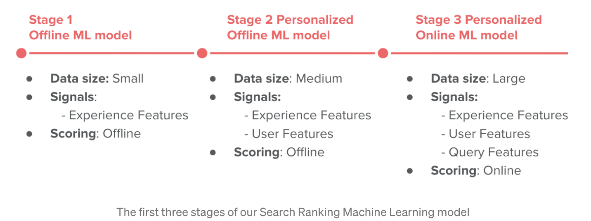
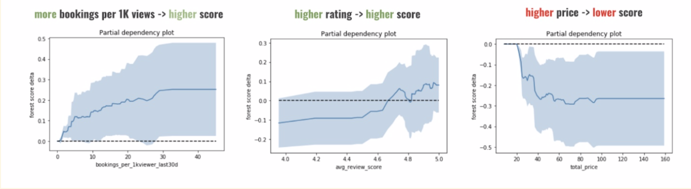
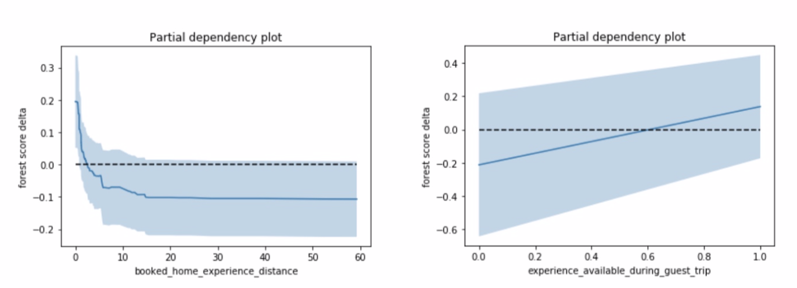
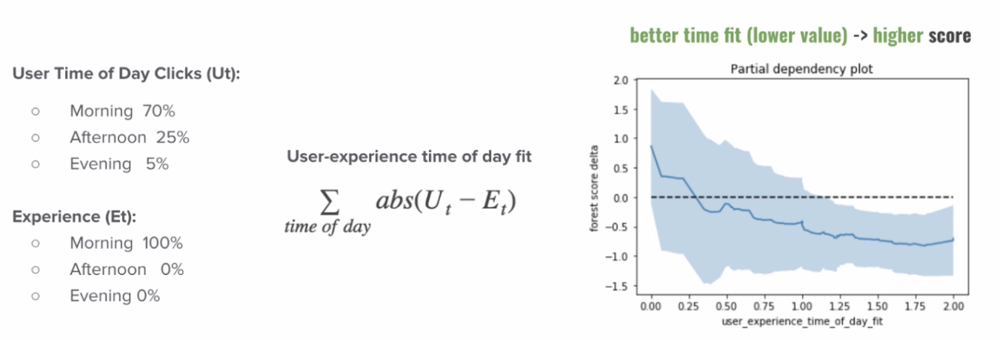

# Airbnb Experiences search ranking system

- [Airbnb Experiences search ranking system](#airbnb-experiences-search-ranking-system)
  - [Background](#background)
  - [Problem:](#problem)
  - [Stage 1: Build a Strong Baseline](#stage-1-build-a-strong-baseline)
    - [采集数据](#采集数据)
    - [特征、训练信号](#特征训练信号)
    - [排序模型训练](#排序模型训练)
    - [排序模型测试](#排序模型测试)
  - [Stage-2: 个性化](#stage-2-个性化)
    - [Query features: 用户特征工程](#query-features-用户特征工程)
      - [1. airbnb定房](#1-airbnb定房)
      - [2. 短期搜索](#2-短期搜索)
    - [模型训练](#模型训练)
    - [测试](#测试)
    - [serving](#serving)
  - [Stage-3: 在线打分](#stage-3-在线打分)
    - [模型训练](#模型训练-1)
    - [设计细节](#设计细节)

[https://medium.com/airbnb-engineering/machine-learning-powered-search-ranking-of-airbnb-experiences-110b4b1a0789](https://medium.com/airbnb-engineering/machine-learning-powered-search-ranking-of-airbnb-experiences-110b4b1a0789)

## Background
Airbnb experience是一些专业匠人举办的handcrafted活动，可以提供小众而品味的体验，体验当地的特色和文化。通过编辑团队的审核后才登陆到平台上。

产品规模：
* 2016年在12个城市上线了500个experience
* 2017年在60个城市举办了5000个活动
* 2018年迅速增长到1000个目的地和2万个活动。

随着experience数量的增涨，搜索、发现和个性化变成产品增长和成功的重要因素。

本文介绍搜索系统在这个产品的不同阶段的形态。

  

The main take-away is that machine learning-based Search Ranking works at every stage, given that we pick the model and infrastructure with the **right level of complexity for the amount of data available and the size of the inventory that needs to be ranked**. Very complex models will not work well when trained with small amounts of data, and simple baselines are sub-optimal when large amounts of training data are available.

take-away:
- 模型的复杂度与产品和数据规模对其：复杂模型在数据不足时效果不会好

## Problem:
Design search ranking system for the airbnb experiences. 
用户选择一些filter(价格，时间，tag)，没有文本query

## Stage 1: Build a Strong Baseline

项目最初期，用户数据很少。这个阶段目的是收集用户行为(impression, click, booking). 这个阶段的策略是每天随机重排，log用户数据，直到收集到一定量数据可以训练stage-1 ML模型。
At that moment, the best choice was to just randomly re-rank Experiences daily, until **a small dataset is collected** for development of the Stage 1 ML model.

### 采集数据
正例：booking数据
负例：点击但未book
通过这种方式收集了**50k**数据作为训练样本

### 特征、训练信号
这个阶段模型只采用了item side特征
* Experience duration (e.g. 1h, 2h, 3h, etc.)
* Price and Price-per-hour
* Category (e.g. cooking class, music, surfing, etc.)
* Reviews (rating, number of reviews)
* Number of bookings (last 7 days, last 30 days)
* Occupancy of past and future instances (e.g. 60%)
* Maximum number of seats (e.g. max 5 people can attend)
* Click-through rate

### 排序模型训练
选择GBDT模型，当作*二分类问题*，*log-loss* loss function

When using GBDT, one does not need to worry much about scaling the feature values, or missing values (they can be left as is). However, one important factor to take into account is that, unlike in a linear model, using raw counts as features in a tree-based model to make tree traversal decisions may be problematic when those counts are prone to change rapidly in a fast growing marketplace. In that case, it is better to use ratios of fractions. For example, instead of using booking counts in the last 7 days (e.g. 10 bookings), it is better to use fractions of bookings, e.g. relative to the number of eyeballs (e.g. 12 bookings per 1000 viewers).
- 使用GBDT模型不需要太考虑特征的scale(不太需要做特征的标准化(minmax, z-score)，这种对于使用gradient descent的模型是需要的，gbdt不需要。) 或者missing values
- 但是考虑特征值的变化，不要使用raw counts类型的特征(例如评论数、booking数)，这些随着业务的增长，特征值的分布会快速变化(例如评论数均值翻倍，那么树模型对新的数据就不适用了。)
- 因此，最好使用ratios of fractions。
	- booking counts in last 7 days (e.g. 10 bookings)-> 12bookings per 1000 viewers

总结：
- 收集少量正负训练样本，训练GBDT模型，二分类，logloss
- 特征方面，无须标准化和缺省值处理，但不可以使用counts类特征(转化成ratio of fractions)

### 排序模型测试
**线下指标评估**：比较baseline(随机排序)与ML模型，指标为AUC和NDCG

**模型理解：特征重要性分析**
In addition, to get a sense of what a trained model learned, we plotted partial dependency plots for several most important Experience features. These plots showed what would happen to specific Experience ranking scores if we fix values of all but a single feature (the one we are examining). As it can be observed in the plots below, the model learned to utilize the features in the following manner:
为了理解模型行为，可以观察某个特征变化对模型打分的影响。

  

**线上评估**：ab-test: bookings +13%
为什么做线上？因为线下模型有很多假设。stage-1的假设是 只对点击的item排序(正负例都来自点击，而不是全部的item)

**实现细节**
- 模型仅仅使用item特征，所有用户看到相同的结果，没有个性化
- query参数(guest数量，时间，地点等)只作为召回的过滤条件，排序模型未使用

## Stage-2: 个性化

### Query features: 用户特征工程
特征来源：airbnb定房，短期搜索点击
#### 1. airbnb定房
experience预定行为，大量来自于定房行为。即，用户通过airbnb定了旅行的住宿，然后在当地查看活动。那么定房会提供旅行的时间、住宿地点等信息，以此得到特征。
特征：地点，trip时间，天数，客人数量，价格(below/above market), 类型(family, business), first trip/return trip; domestic/international; lead day
特征举例：
1. 活动与住房距离，客人喜欢距离住处较近的活动
2. trip时间段内，活动available
  
#### 2. 短期搜索
用户short term click的experience可以体现用户感兴趣的类型(音乐、运动等)，用户感兴趣的活动时间短(晚上？上午？）

特征举例：
1. **Category Intensity**: $$CategoryIntensity=\sum_{d=d_0}^{d_{now}}\alpha^{d-d_{now}} A_d$$
	* 某个category，过去15天的点击数做weighted sum
	* $A_d$为第d-th天，某category的experience点击数
* **Category Recency**: 最后一次点击某category experience 距今的天数
  
* **Time of day Personalization**: 计算用户点击活动时间偏好与活动时间的fit
  

### 模型训练
收集训练数据，根据特征工程定义，在点击数据中构造特征值。
数据量：inventory增长到4k，250k训练数据，50左右个特征

如何避免“标签泄漏” leak of label?
> 1. 使用book之前的点击行为
> 2. 对于booking example，只选择历史数和点击活动类型大于1的，ie: 去掉只点击一个活动或者一种类型活动，然后book这种情况

登陆用户与未登陆用户分别处理
> 未登陆用户没有定房数据，点击历史也非常少，由于这些特征对个性化模型影响较大，不适合未登陆用户。
> 维护**两个模型**更合适。

### 测试
ab实验表明，个性化相比于stage-1，booking数增长7.9%

### serving
1. 维护有个性化的user_id，用来判断使用个性化模型还是log-out模型
2. 用于个性化特征线上计算量大，只对1 million的活跃用户使用个性化特征
3. 个性化特征是每日计算，也就是特征值有1天的延迟（没有真正的短期兴趣，也给下一步的模型迭代保留了增长空间。stage-2证明了个性化的有效性）

## Stage-3: 在线打分

因此stage-2证明了个性化排序模型的有效性，可以投入更多资源。这阶段，前段UI设计也增加了几个Query特征：location，日期和人数(不再需要从room booking来推测)，这样可以得到更多有效特征。

Query特征：
1. Distance between Experience and Entered Location
2. number of guests (singles, couple, large group)，通过计算experience平均book人数
3. 浏览器信息：语言、所在国家。匹配experience提供语言情况，出发国家到目的地国家的experience偏好

### 模型训练
仍然是两个模型
* log-in用户：experience特征+query特征+user特征
* log-out用户：experience特征+query特征

### 设计细节
存储：
* User feature: key-value stores。 数据量较大 千万-亿级别.
* Experience features: 内存。 万级，较小.
* Query feature: 实时计算
