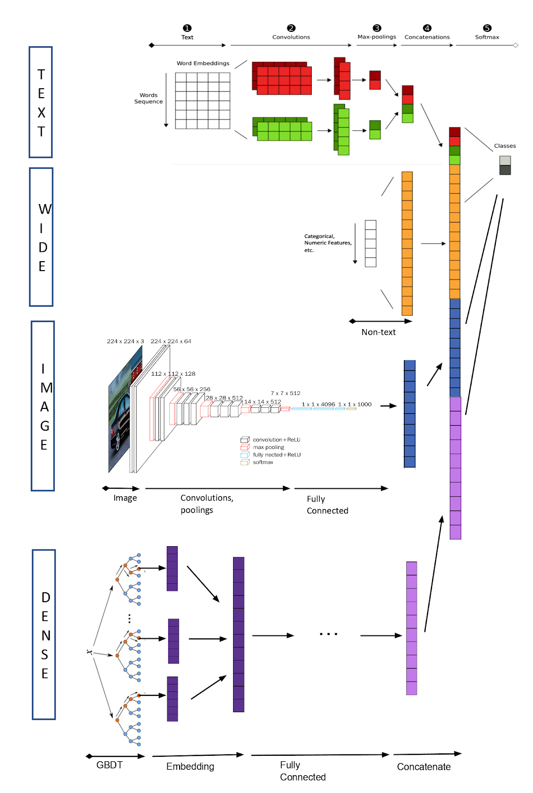

# AirBnb: WIDeText: A Multimodal Deep Learning Framework

https://medium.com/airbnb-engineering/widetext-a-multimodal-deep-learning-framework-31ce2565880c

Airbnb做房屋图片分类的一种wide&deep模型，集合了文本、图片和数值特征。

At Airbnb, we developed an in-house PyTorch based multimodal deep learning framework, named WIDeText: Wide, Image, Deep, and Text, to enable developing and productionizing classification systems at ease.

  

